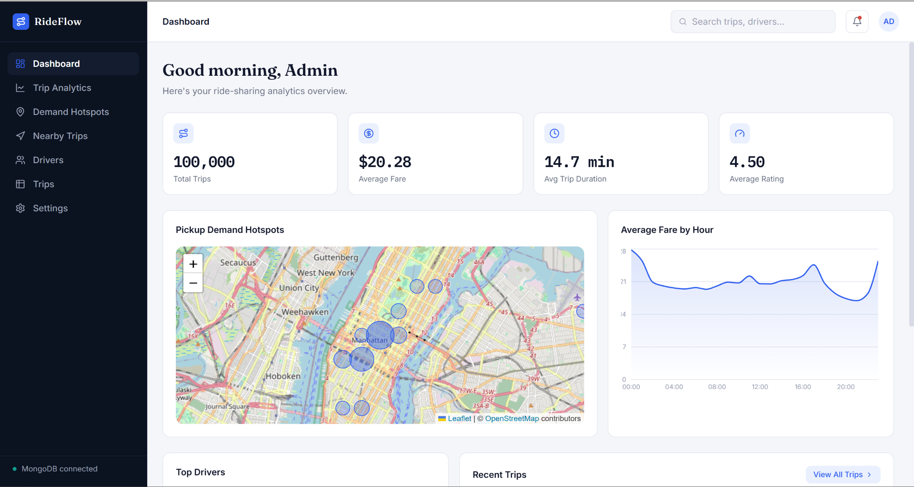
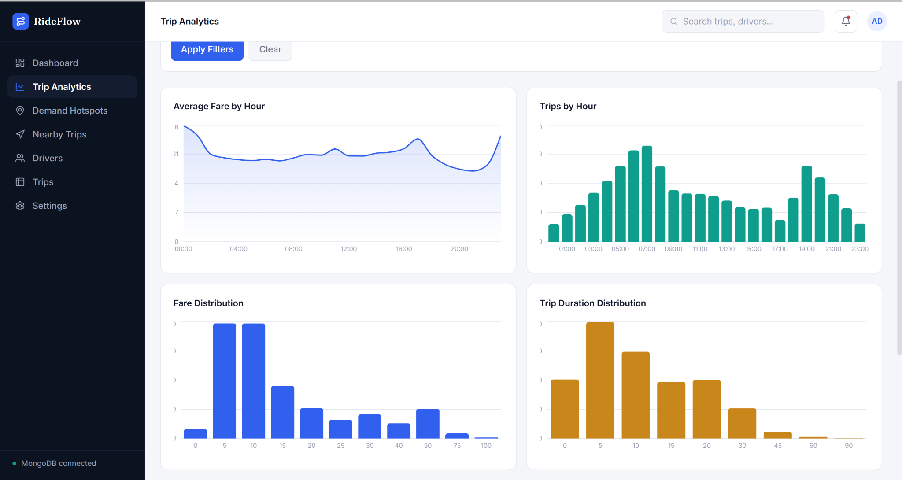
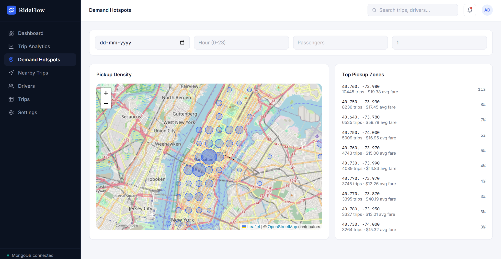
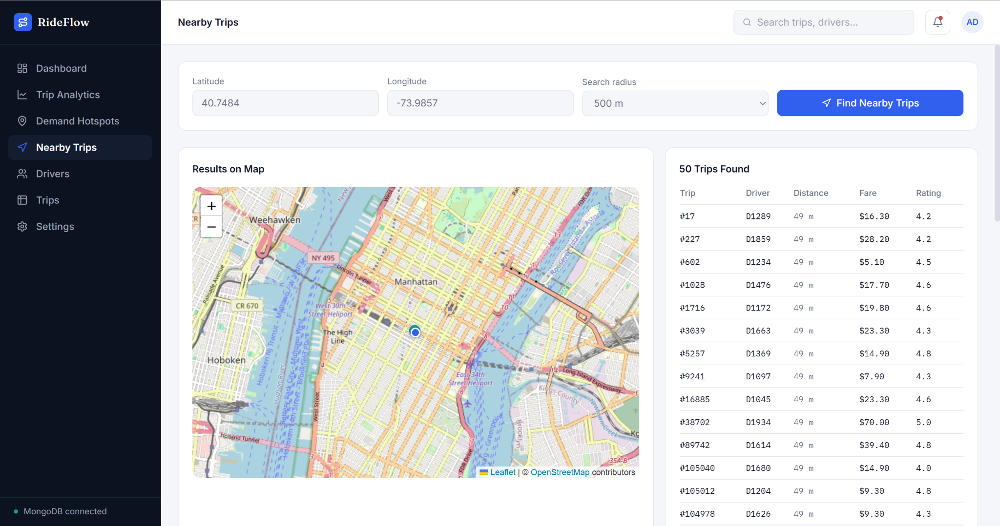
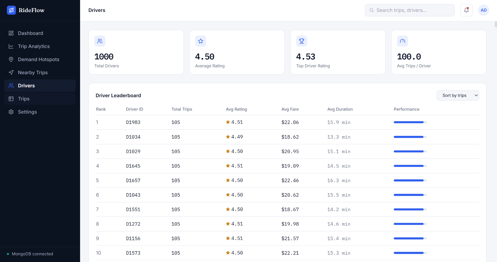
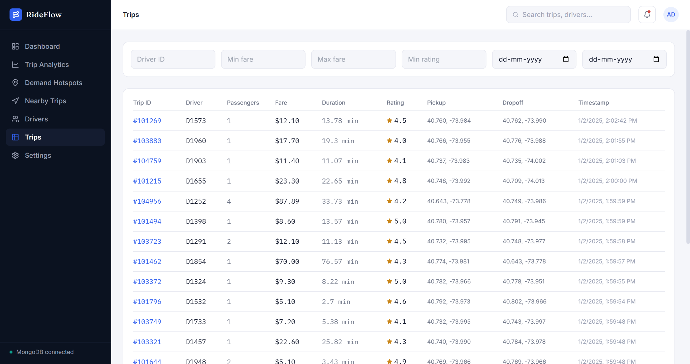
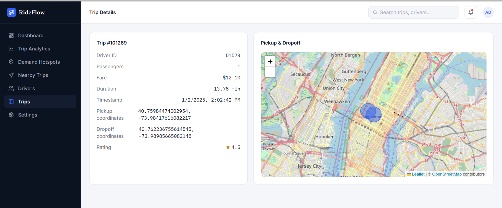
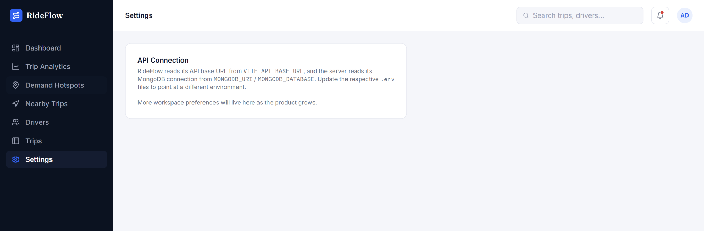

# RideFlow Analytics 🚗📊

A full-stack ride-sharing analytics platform built with **React, Node.js, Express, TypeScript, and MongoDB**.

RideFlow Analytics provides interactive dashboards, trip analytics, driver insights, demand hotspot visualization, trip search, and real geospatial nearby-trip queries using MongoDB's `$geoNear` and `2dsphere` index.

## 🚀 Live Demo

👉 **[RideFlow Analytics – Live Demo](https://rideflow-analytics-mdd331niq-pavans9912-3599s-projects.vercel.app)**

### Production Architecture

- **Frontend:** Vercel
- **Backend API:** Render
- **Database:** MongoDB Atlas
- **Dataset:** 100,000 trip records

---

## 📌 Overview

RideFlow Analytics is designed to analyze ride-sharing trip data at scale.

The system currently contains **100,000 trip records** stored in MongoDB Atlas. Analytics are generated using MongoDB aggregation pipelines, while nearby-trip searches use MongoDB's geospatial `$geoNear` query with a `2dsphere` index.

The processed results are displayed through interactive charts, tables, maps, and KPI dashboards.

---

## ✨ Features

### 📊 Dashboard
- Total trips
- Average fare
- Average trip duration
- Average rating
- Pickup demand hotspot map
- Average fare by hour
- Top drivers
- Recent trips

### 📈 Trip Analytics
- Filter trips by date and hour
- Passenger-count filtering
- Fare range filtering
- Rating filtering
- Average fare by hour
- Trips by hour
- Fare distribution
- Trip duration distribution
- Passenger distribution
- Rating distribution

### 📍 Demand Hotspots
- Interactive pickup demand map
- Pickup zone density analysis
- Top pickup zones
- Date and hour filtering
- Passenger-count filtering
- Minimum-trip filtering

### 🗺️ Nearby Trips
- Latitude and longitude based search
- Radius search from 500 m to 10 km
- MongoDB `$geoNear` geospatial query
- MongoDB-based distance calculation
- Map and table results

### 👨‍✈️ Drivers
- Driver leaderboard
- Sort by trips, rating, and fare
- Fleet statistics
- Top driver analysis

### 🚕 Trips
- Searchable trip table
- Filtering
- Sorting
- Pagination
- Individual trip details
- Pickup and dropoff locations

### ⚙️ Settings
- Application connection configuration reference

---

## 🛠️ Technology Stack

| Layer | Technologies |
|---|---|
| Frontend | React 18, TypeScript, Vite, Tailwind CSS |
| Routing | React Router |
| Charts | Recharts |
| Maps | React-Leaflet |
| Backend | Node.js, Express, TypeScript |
| Validation | Zod |
| ODM | Mongoose |
| Database | MongoDB Atlas |
| Analytics | MongoDB Aggregation Pipelines |
| Geospatial Queries | `$geoNear` + `2dsphere` |
| Data Import | Node.js Streaming CSV Parser + Batch Bulk Insert |
| Frontend Deployment | Vercel |
| Backend Deployment | Render |
| Database Hosting | MongoDB Atlas |

---

## 🏗️ System Architecture

```text
                         User / Browser
                              │
                              ▼
                   ┌─────────────────────┐
                   │   Vercel Frontend   │
                   │ React + TypeScript  │
                   │ Vite + Tailwind CSS │
                   └──────────┬──────────┘
                              │
                           REST API
                              │
                              ▼
                   ┌─────────────────────┐
                   │   Render Backend    │
                   │ Node + Express + TS │
                   └──────────┬──────────┘
                              │
                              ▼
                   ┌─────────────────────┐
                   │    MongoDB Atlas    │
                   │  ride_sharing_db    │
                   │       trips         │
                   └─────────────────────┘
```

---

### Data Processing Flow


```text
CSV Dataset
     │
     ▼
Streaming CSV Importer
     │
     ▼
Data Validation & Transformation
     │
     ▼
Batch Bulk Insert
     │
     ▼
MongoDB Atlas
     │
     ├── Aggregation Pipelines
     │
     └── $geoNear Geospatial Queries
              │
              ▼
          Express API
              │
              ▼
        React Dashboard

```

---


## 📊 Dataset

The project uses a dataset containing **100,000 trip records**.

Each trip contains:

-  Trip ID 
-  Driver ID 
-  Passenger count 
-  Pickup location 
-  Dropoff location 
-  Fare 
-  Trip duration 
-  Rating 
-  Timestamp 

### Database

```
Database: ride_sharing_db
```

Collection: trips

Documents: 100,000

---

## 🗄️ Database Schema

```
{
```

trip\_id: 100001,

driver\_id: "D1001",

passenger\_count: 2,


pickup\_location: {

type: "Point",

coordinates: [-73.9857, 40.7484]

  },


dropoff\_location: {

type: "Point",

coordinates: [-73.9712, 40.7831]

  },


fare: 18.75,

duration: 24,

rating: 4.7,

timestamp: ISODate("...")

}

Coordinates use GeoJSON format:

```
[lng, lat]
```

### Indexes

The `trips` collection uses indexes for efficient querying:

- `trip_id` — unique 
- `driver_id` 
- `timestamp` 
- `fare` 
- `pickup_location` — `2dsphere` 

---

## 🗺️ Geospatial Analytics

RideFlow Analytics uses MongoDB geospatial capabilities for nearby-trip searches and demand analysis.

The `pickup_location` field uses a GeoJSON `Point` with a MongoDB `2dsphere` index.

Nearby-trip searches use the `$geoNear` aggregation stage.

```
User provides
```

Latitude + Longitude + Radius

              │

              ▼

       MongoDB $geoNear

              │

              ▼

      Distance calculation

              │

              ▼

      Matching trip records

              │

              ▼

        Express API

              │

              ▼

       Map + Trip Table

Distance is calculated by MongoDB rather than by the frontend.

---

## 🔌 API Documentation

Full API documentation is available in:

```
docs/api-documentation.md
```

### Main Endpoints

| MethodEndpointPurpose |                                      |                                      |
| --------------------- | ------------------------------------ | ------------------------------------ |
| GET                   | `/api/dashboard`                     | Dashboard analytics                  |
| GET                   | `/api/trips`                         | Paginated and filtered trips         |
| GET                   | `/api/trips/:id`                     | Single trip                          |
| GET                   | `/api/trips/nearby`                  | Geospatial nearby-trip search        |
| GET                   | `/api/analytics/fare-by-hour`        | Average fare by hour                 |
| GET                   | `/api/analytics/hotspots`            | Pickup demand hotspots               |
| GET                   | `/api/analytics/fare-distribution`   | Fare distribution                    |
| GET                   | `/api/analytics/trip-duration`       | Trip duration distribution           |
| GET                   | `/api/analytics/passengers`          | Passenger distribution               |
| GET                   | `/api/analytics/rating-distribution` | Rating distribution                  |
| GET                   | `/api/analytics/trips-by-hour`       | Trip volume by hour                  |
| GET                   | `/api/drivers`                       | Driver leaderboard and fleet summary |
| GET                   | `/api/drivers/top`                   | Top drivers                          |

---


## 📁 Project Structure

```
rideflow-analytics/
```

│

├── client/

│   └── React frontend

│

├── server/

│   └── Express backend

│

├── scripts/

│   └── import-data/

│       ├── importTrips.ts

│       └── check-db.ts

│

├── data/

│   └── Dataset and geospatial data

│

├── docs/

│   └── Architecture, API and geospatial documentation

│

├── .gitignore

└── README.md

---

## ⚙️ Local Installation

### Prerequisites

-  Node.js 18+ 
-  MongoDB local instance or MongoDB Atlas 
-  Git 

### 1. Clone the repository

```
git clone https://github.com/PAVAN-9912/rideflow-analytics.git
```

cd rideflow-analytics

### 2. Backend

```
cd server
```

npm install

Create a `.env` file:

```
MONGODB_URI=mongodb://localhost:27017
```

MONGODB\_DATABASE=ride\_sharing\_db

PORT=5000

CLIENT\_ORIGIN=[http://localhost:5173](http://localhost:5173)

Run the backend:

```
npm run dev
```

### 3. Frontend

Open another terminal:

```
cd client
```

npm install

Create a `.env` file:

```
VITE_API_BASE_URL=http://localhost:5000/api
```

Run the frontend:

```
npm run dev
```

Frontend:

```
http://localhost:5173
```

### 4. Import Dataset

```
cd scripts/import-data
```

npm install

npm run import -- /path/to/your-dataset.csv

---

## 🌐 Deployment

The production application uses:

```
Frontend
```

   │

   └── Vercel

          │

          ▼

      REST API

          │

          ▼

Backend

   │

   └── Render

          │

          ▼

Database

   │

   └── MongoDB Atlas

The production application has been tested with the imported **100,000-trip dataset**.

The following pages were verified after deployment:

-  ✅ Dashboard 
-  ✅ Trip Analytics 
-  ✅ Demand Hotspots 
-  ✅ Nearby Trips 
-  ✅ Drivers 
-  ✅ Trips 
-  ✅ Trip Details 
-  ✅ Settings 

---

## 📸 Screenshots

### 📊 Dashboard

Overview of the ride-sharing dataset with KPI cards, demand hotspots, fare
trends, top drivers, and recent trips.



---

### 📈 Trip Analytics

Interactive charts for fare, duration, passengers, ratings, and trip volume.



---

### 📍 Demand Hotspots

Geographical visualization of pickup demand using an interactive map.



---

### 🗺️ Nearby Trips

Radius-based geospatial trip search powered by MongoDB `$geoNear`.



---

### 👨‍✈️ Drivers

Driver rankings and fleet-level statistics.



---

### 🚕 Trips

Searchable, filterable, and paginated trip data.



---

### 🔎 Trip Details

Detailed information for an individual trip, including fare, duration, rating,
pickup/dropoff locations, and the map view.



---

### ⚙️ Settings

Application connection and configuration reference.



## ✅ Project Verification

### Verification Results

| ComponentStatus          |                   |
| ------------------------ | ----------------- |
| MongoDB Atlas connection | ✅ Working         |
| Dataset import           | ✅ 100,000 records |
| Backend API              | ✅ Working         |
| Frontend deployment      | ✅ Working         |
| Dashboard                | ✅ Working         |
| Trip Analytics           | ✅ Working         |
| Demand Hotspots          | ✅ Working         |
| Nearby Trips             | ✅ Working         |
| Drivers                  | ✅ Working         |
| Trips                    | ✅ Working         |
| Trip Details             | ✅ Working         |
| Settings                 | ✅ Working         |

---

## 🎯 Project Highlights

RideFlow Analytics demonstrates:

-  Full-stack web development 
-  React and TypeScript development 
-  REST API development 
-  MongoDB database design 
-  MongoDB aggregation pipelines 
-  Geospatial database queries 
- `$geoNear` implementation 
- `2dsphere` indexing 
-  Interactive data visualization 
-  Large dataset processing 
-  Cloud deployment 
-  Vercel + Render + MongoDB Atlas integration 

---

## 👨‍💻 Project

**RideFlow Analytics**

A full-stack ride-sharing analytics platform built to demonstrate real-world data processing, analytics, geospatial querying, visualization, and cloud deployment.

```


```

\### Then save it and run these commands


You're already in the \*\*correct repository folder\*\*:


\`\`\`powershell

cd "C:\Users\PAVAN S\OneDrive\Desktop\rideflow-analytics\rideflow-analytics"


